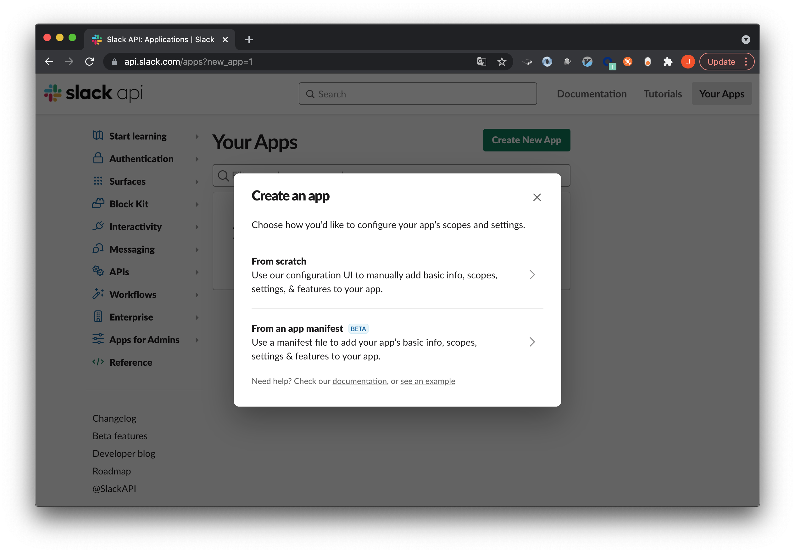
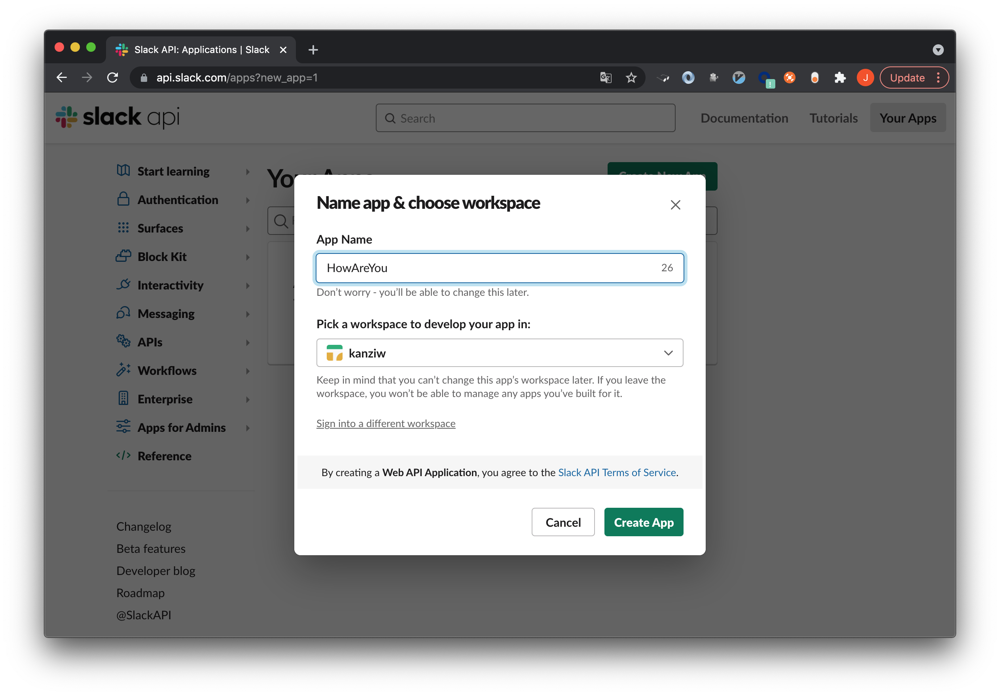
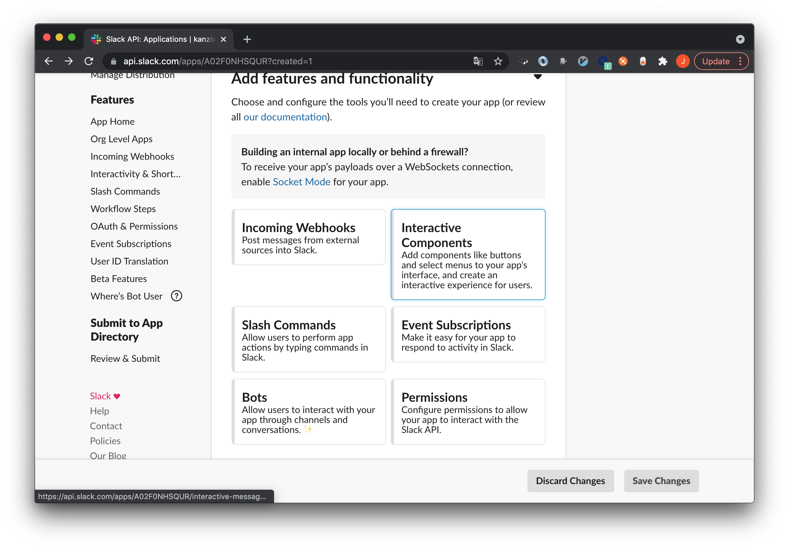
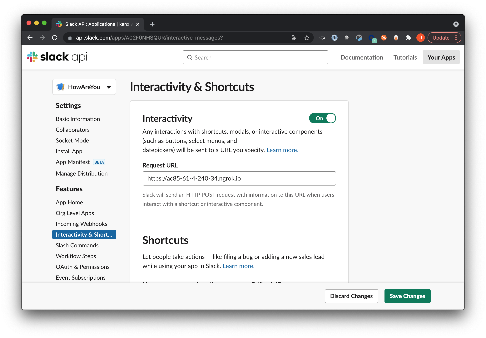

# howareyou

## Getting started

### Create an app

Go to https://api.slack.com/apps?new_app=1

Select `From scratch`

Type name and select workspace

### Configure bot

Select `Interactive Components`

Turn on `Interactive` and fill `Request URL`

And `Save Changes`
